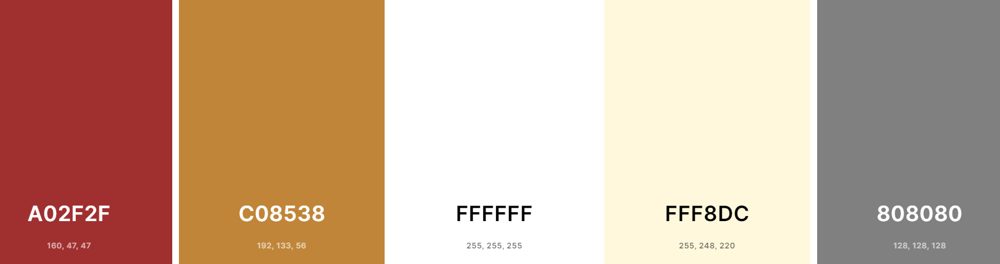
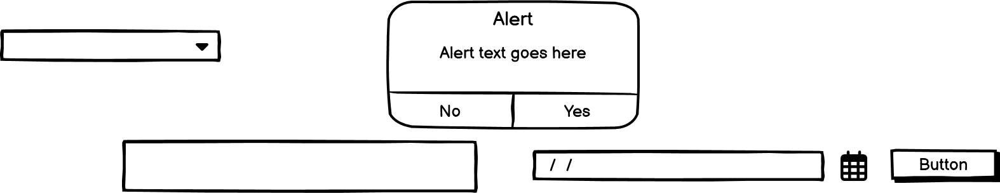
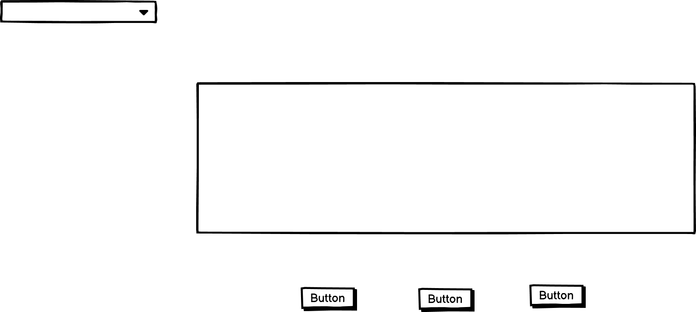

# BE ORGANISED AND ACHIEVE THE DREAMS

"Be organised and achieve the dreams" application is designed to be responsive that allow visitors to view on a range of devices. And also it helps the visitors to be organised in their day today work and to reach the dreams.

[View BE ORGANISED AND ACHIEVE THE DREAMS as an application on web.](https://8000-piumianurad-beorganised-k1t7zwbttik.ws-eu104.gitpod.io/index.html)

## CONTENTS
* User Experience (UX)
     * Initial Discussion
     * User stories

* Design
     * Color Scheme
     * Typography
     * Imagery
     * Wire Frames
     * Features
     * Accessibility

* Technologies Used
     * Languages
     * Frameworks and Programs 

* Deployment  

* Testing
     * W3C Validator
     * Solved Bugs
     * Known Bugs
     * Testing User Stories
     * Lighthouse
        * Index page
        * TodoList page
        * Timer page
     * Full Testing

* Credits
     * Code Used
     * Content
     * Media
     * Acknowledgement

## USER EXPERIENCE

### First Time Visitor Goals
1. To be able to view the application on a range of device sizes.
2. To get an idea how to organise your day to day tasks.
3. To get an idea how to achieve each task with an allocated time.

### Frequent Visitor Goals

1. To be able to use the application as habbit in day today life.
2. To be able to organise your life in order to achieve the dream goals.

## DESIGN

### Color scheme

The web application uses a palette of colours that are used in BE ORGANISED AND ACHIEVE THE DREAMS logo, images, buttons and menues. The colour palette was created using the Coolors website.

## TYPOGRAPHY
"Roboto" font in Google Fonts was used for the whole web application.

## IMAGERY

All the images were created using the Snipping tool software.

## WIREFRAMES

Wireframes were created for mobile, tablet and desktop.

#### Home Page Wireframe

#### Todolist to be prepared Wireframe

##### Todolist to be prepared Wireframe with alert box

#### Timer Wireframe

## FEATURES

This web application has three pages.Two of the pages are accessible from the dropdown menu (TodoList to be prepared, The timer to be stay focused).

* Be Organised Page

This page has a drop down menu that navigates to other two pages that are Todilist to be prepared page and The Timer to Stay Focused.

* TodoList to be prepared page
The page has a drop down menu that navigates to other two pages that are Be Organied page and The Timer to Stay Focused.

*The Timer to Stay Focused
This page has a drop down menu that navigates to other two pages that are Be Organised page and TodoList to be prepared page. 
  

## ACCESSIBILITY

This application has been carefully desined in order to be accessible friendly as posible. Accessibility has been achieved by,
* Using semantic HTML
* Ensuring that the colour contrast is sufficient enough through out the web application.

## TECHNOLOGIES USED
* Languages Used
     * HTML,CSS and JavaScript were ued to create this web application.
     * Frameworks and Programs used
     * Balsamiq was used to create wireframes.
     * Git was used for version control.
     * Github was used to save and store the files for the application.
     * Google Fonts are used to import the fonts used on the web application.
     * Google Dev Tools were used to troubleshoot and test features, solve issues with regard to the responsiveness and styling.
     * Am I responsive? has been used to ensure the web application is responsive for all the devices.

## DEPLOYMENT AND LOCAL DEVELOPMENT

### Deployment
Github pages has been used to deploy the live website. 

The instructions are a follows:

1. Log in to Github
2. Find the reporsitory for the particular project, BE ORGANISED AND ACHIEVE THE DREAMS.
3. Click on the Settings link
4. Click on the pages link in the left hand side navigation bar.
5. In the Source section, choose main from the dropdown, select the branch menu. Select Root from the drop down select folder menu.
6. Click Save. Your live Github pages site is now deployed at the URL down.

I am a worker who works in the retail and the care sectors. I learn programming while I am working. Therefore I have a very tight schedule and it is very difficult to find time to study. Finding a study has become more challenging on hectic days due to the physical tiredness of work in the work places. 
I somhow had to achieve my targets in order to reach my dreams. As the first step of achieving my dream, it was realised that my daily routines needed to be more organised. First of all I wrote down my dreams. And then they were broken down in to sub sections. Then those sub-section were divided in tasks that can be achieved in a given time period of time. Following the concepts of " Eating the elephant in bite sizes" and also SMART (S-specific, M-measurable, A-achievable, R-relavent, T-time bound) theory were applied. 
As a result of these needs, BE ORGANISED AND ACHIEVE THE DREAMS web site has been designed. 
I find that it is very important to write your task and give it a deadline. While you are working for these tasks, it is very important to do the task according to a timer which helps you to improve your productivity levels. I somehow managed to work according to the targets along with deadlines and a timer. 
These is the reason behind to develop a todo list with a deadline and a timer.

