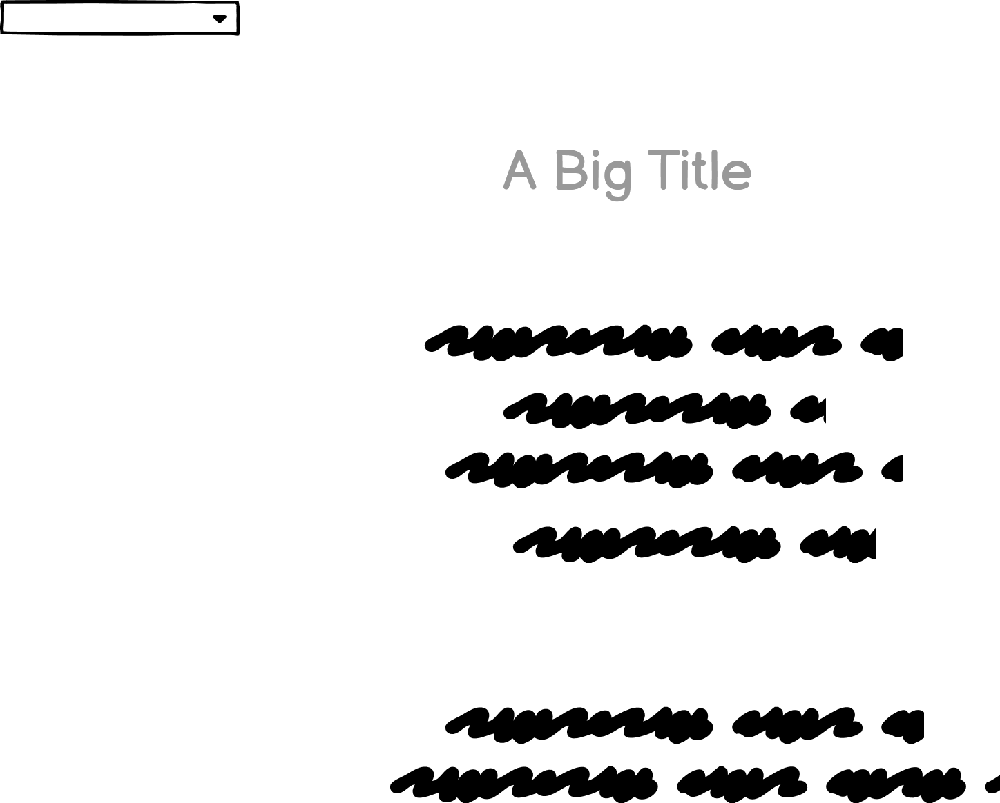
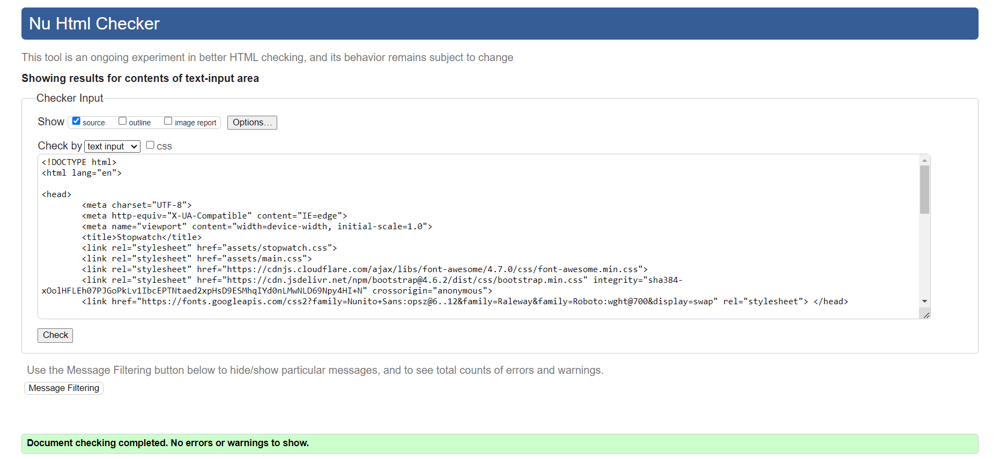

# BE ORGANISED AND ACHIEVE THE DREAMS

"Be organised and achieve the dreams" application is designed to be responsive that allow visitors to view on a range of devices. And also it helps the visitors to be organised in their day today work and to reach the dreams.

**********************

[View BE ORGANISED AND ACHIEVE THE DREAMS as an application on web.](https://piumianuradha.github.io/Be-Organised/)

## CONTENTS
* User Experience (UX)
     * Initial Discussion
     * User stories

* Design
     * Color Scheme
     * Typography
     * Imagery
     * Wire Frames
     * Features
     * Accessibility

* Technologies Used
     * Languages
     * Frameworks and Programs 

* Deployment  

* Testing
     * W3C Validator
     * Solved Bugs
     * Testing User Stories
     * Lighthouse
        * Index page
        * TodoList page
        * Timer page
     

* Credits
     * Acknowledgement

## USER EXPERIENCE

### First Time Visitor Goals
1. To be able to view the application on a range of device sizes.
2. To get an idea how to organise your day to day tasks.
3. To get an idea how to achieve each task with an allocated time.

### Frequent Visitor Goals

1. To be able to use the application as habbit in day today life.
2. To be able to organise your life in order to achieve the dream goals.

## DESIGN

### Color scheme

The web application uses a palette of colours that are used in BE ORGANISED AND ACHIEVE THE DREAMS logo, images, buttons and menues. The colour palette was created using the Coolors website.

## TYPOGRAPHY
"Roboto" font in Google Fonts was used for the whole web application.

## IMAGERY

All the images were created using the Snipping tool software.

## WIREFRAMES

Wireframes were created for mobile, tablet and desktop.

### Home Page Wireframe

**********************

### Todolist to be prepared Wireframe

**********************
### Todolist to be prepared Wireframe with alert box

**********************

### Timer Wireframe

**********************

## FEATURES

This web application has three pages.Two of the pages are accessible from the dropdown menu (TodoList to be prepared, The timer to be stay focused).

* Be Organised Page

This page has a drop down menu that navigates to other two pages that are Todilist to be prepared page and The Timer to Stay Focused.

* TodoList to be prepared page
The page has a drop down menu that navigates to other two pages that are Be Organied page and The Timer to Stay Focused.

*The Timer to Stay Focused
This page has a drop down menu that navigates to other two pages that are Be Organised page and TodoList to be prepared page. 
  

## ACCESSIBILITY

This application has been carefully desined in order to be accessible friendly as posible. Accessibility has been achieved by,
* Using semantic HTML
* Ensuring that the colour contrast is sufficient enough through out the web application.

## TECHNOLOGIES USED
* Languages Used
     * HTML,CSS and JavaScript were ued to create this web application.
     * Frameworks and Programs used
     * Balsamiq was used to create wireframes.
     * Git was used for version control.
     * Github was used to save and store the files for the application.
     * Google Fonts are used to import the fonts used on the web application.
     * Google Dev Tools were used to troubleshoot and test features, solve issues with regard to the responsiveness and styling.
     * Am I responsive? has been used to ensure the web application is responsive for all the devices.

## DEPLOYMENT AND LOCAL DEVELOPMENT

### Deployment
Github pages has been used to deploy the live website. 

The instructions are a follows:

1. Log in to Github
2. Find the reporsitory for the particular project, BE ORGANISED AND ACHIEVE THE DREAMS.
3. Click on the Settings link
4. Click on the pages link in the left hand side navigation bar.
5. In the Source section, choose main from the dropdown, select the branch menu. Select Root from the drop down select folder menu.
6. Click Save. Your live Github pages site is now deployed at the URL down.

## TESTING
### Principles of automated and manual testing
Automated testings are performed with according to a script. And also automated testings are executed via test automation frameworks and with other tools and software. Therefore automated testings are faster.

Automated testing allows the developers to test as much as they want without making high costs.Not only giving the benefit of frequent testing, it provides the continuous feedback to the developer to spot the bugs and errors at the beginning. And also it allows the developer to improve the design, code quality, timely launches, reduces the quality, low mainenance.

Manual testings are performed by humans step by steps without a script. And in manual testing, exploratary testings are posible.

### Testing in this application

In this application manual testings have been performed. The reasons for performing manual testings are, 
     * Human observation can be used in this application which can be useful to offer user-friendly system.
     * Automation tests can be time consuming when testing small changes in the codes. 

### W3C Validator
W3C Validator has been used to validate all three HTML pages and CSS pages.
The screen shots are as follows:

### HTML W3C Validator for index, stopwatch and todolist pages

*********

*********

********

### CSS W3C Validator for index.css, stopwatch and for the todo list page

********

**********

***********

### JSHint for Javascript

*********

## TESTING USER STORIES

### First timer visitor
* I find this web application easier to navigate with the dropdown menu and the color themes that have been used are very beautiful that encourage to use and stay on the application while making the day to day tasks organised.

### Returning Visitor
* This application is very helpful when organising daily routines and working according to a stopwatch.

## LIGHTHOUSE
Chrome developer, Lighthouse has been used to test the performance, accesibility, the best practices and SEO of the web application.

Lighthouse
I used Lighthouse within the Chrome Developer Tools to allow me to test the performance, accessibility, best practices and SEO of the website.

## CREDIT
### Acknowledgement
I would like to take this as an opportunity to acknowledge the following people who helped me along the way in completing my second milestone project:
1. Ms Rachel Furlong -  the tutor, for her help in completing my project.
2. Mr Ben Kavanagh - the mentor, for his help in the second miestone project

